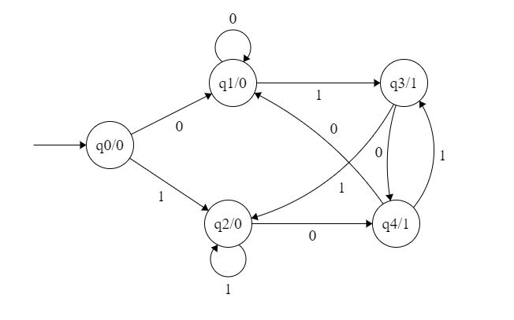
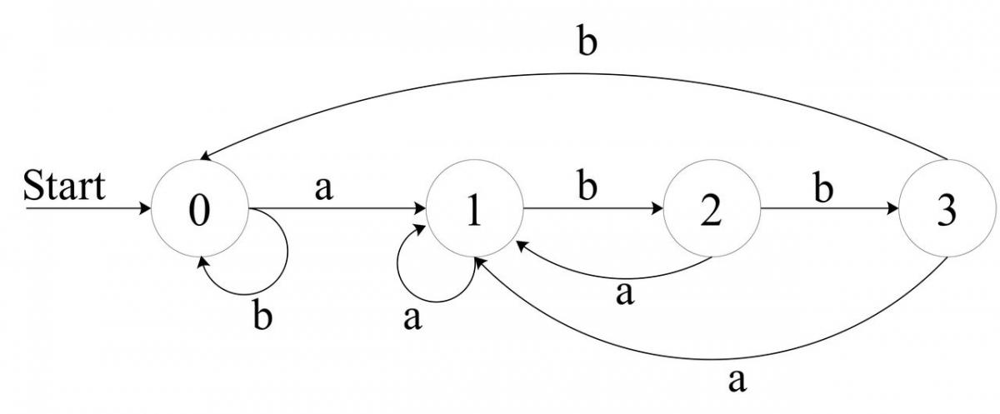
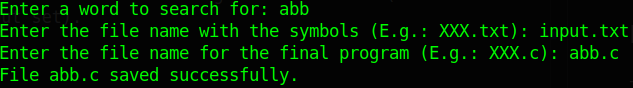

# Ti_AuthomatMoore
Finite state machine. Moore machine. Authomat Moore.

---

## Definition

A <b>Finite State Machine</b> is a model of computation based on a hypothetical machine made of one or more states. Only one single state of this machine can be active at the same time. It means the machine has to transition from one state to another in to perform different actions.

<b>Moore Machines:</b> Moore machines are finite state machines with output value and its output depends only on present state. It can be defined as (Q, q0, ∑, O, δ, λ) where:

> <b>Q:</b> finite set of states  
> <b>q0:</b> initial state of machine  
> <b>∑:</b> finite set of input symbols  
> <b>O:</b> output alphabet  
> <b>δ:</b> transition function where Q × ∑ → Q  
> <b>λ:</b> output function where Q → O  

<p align="center">
  
</p>

---

## Problem

Find in one round of each symbol how many times a word from the alphabet <b>Q</b> is repeated in the input set <b>∑</b>.

To solve this problem, I wrote a program that generates a program in which the <i>Moore Machine</i> is used.

---

## Example

Imagine we have an alphabet of characters <i><b>Q</b> = {a, b}</i> and word we are looking for: `abb`. We will search for this word in an arbitrary set of input data. But for example, let's take it: `ababbabbaabbabbabaaabba`.

Let's build a <i>Moore diagram</i> for this example:

<p align="center">
  
</p>

The program loop for this case will look like this:

```cpp
while(fscanf(Symbols, "%c", &symbol) == 1) { // Reading one by one each symbol of input data.
    if(q0 == 0 && symbol == 'a') q0++;
    else if(q0 == 1 && symbol == 'a') q0 = 1;
    else if(q0 == 1 && symbol == 'b') q0++;
    else if(q0 == 2 && symbol == 'a') q0 = 1;
    else if(q0 == 2 && symbol == 'b') { q0 = 0; Num_Of_Found_Words++; } // We found the right word
    else q0 = 0;
}
```

If we do everything right, then at the end we should get the answer 5 (the number of words found in the input set).

---

## How to use my program

The program requires 3 things as input:

* A word to search for
* The file name with the symbols
* The file name for the generated program

Example:

<p align="center">
  
</p>

After entering the required input data, a new program with the previously specified name is generated:

```cpp
// (c) Tivole

// abb

#include <stdio.h>

int main(void) {

	char letter;
	int cond = 0, Num_Of_Found_Words = 0;

	FILE *Symbols = fopen("input.txt", "r");

	if(!Symbols) {
		printf("(!) Error while opening file. Perhaps it does not exist.\n");
		return 1;
	}

	while(fscanf(Symbols, "%c", &letter) == 1) {
		if(cond == 0 && letter == 'a') cond++;
		else if(cond == 1 && letter == 'a') cond = 1;
		else if(cond == 1 && letter == 'b') cond++;
		else if(cond == 2 && letter == 'a') cond = 1;
		else if(cond == 2 && letter == 'b') { cond = 0; Num_Of_Found_Words++; }
		else cond = 0;
	}

	printf("Num of found words: %d\n", Num_Of_Found_Words);

	fclose(Symbols);

	return 0;
}
```

If we take the example analyzed above as input, then at the program output we get:

```
Num of found words: 5
```